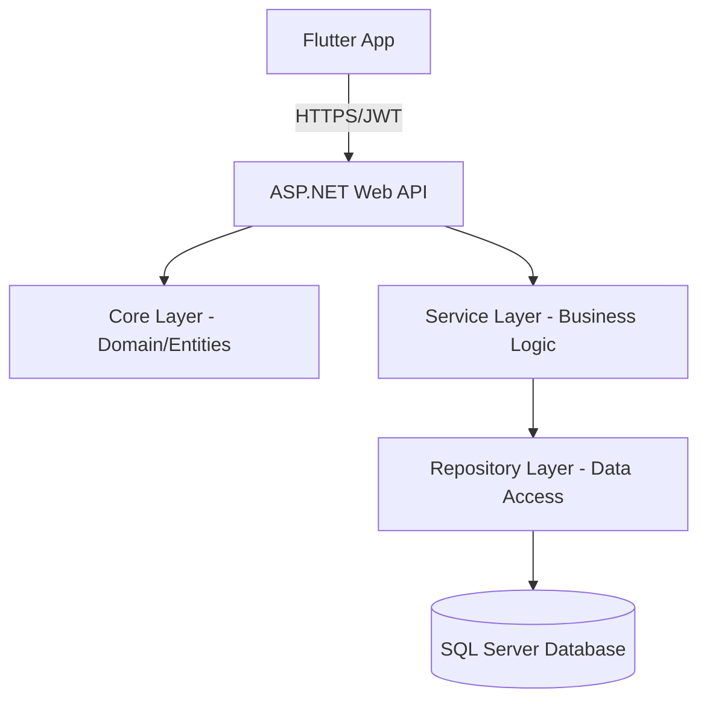

# 🕊️ Donation Management System

[](https://dotnet.microsoft.com/)
[](https://learn.microsoft.com/en-us/ef/core/)
[](https://flutter.dev/)
[](https://www.microsoft.com/en-us/sql-server/)

A comprehensive and professional solution for managing charitable donations, tracking beneficiaries (Cases), and streamlining fund distribution with real-time KPI dashboards.

---

## 🌍 Overview | نظرة عامة

**English:**
The Donation Management System is a robust enterprise-level application designed to bridge the gap between donors and those in need. It provides a secure, transparent, and efficient way to manage the entire donation lifecycle—from initial contribution to final distribution.

**عربي:**
نظام إدارة التبرعات هو تطبيق متكامل مصمم لسد الفجوة بين المتبرعين والمحتاجين. يوفر النظام وسيلة آمنة وشفافة وفعالة لإدارة دورة حياة التبرع بالكامل—من المساهمة الأولية وحتى التوزيع النهائي.

---

## 🚀 Key Features | المميزات الرئيسية

### 📊 Advanced Analytics & Dashboard
- **Real-time KPIs**: Track Total Donations, Active Cases, Donor Growth, and Distributed Funds.
- **Trend Analysis**: Month-over-month performance comparisons and historical trends (Monthly/Weekly/Hourly).
- **Activity Monitoring**: Live feeds for the most recent donations and distributions.

### 👥 Multi-Portal Access
- **Admin/Employee Portal**: Comprehensive back-office tools for managing cases, employees, and financial reports.
- **Donor Portal**: Dedicated interface for contributors to track their impact, view history, and manage profiles.
- **Role-Based Security**: Fine-grained access control (Admin, Supervisor, Donor).

### 💰 Financial Integrity
- **Donation Tracking**: Categorized fund tracking (Health, Education, Food, etc.).
- **Smart Distribution**: Automated and manual fund allocation to approved cases.
- **Auditing**: Every transaction is linked to an employee or supervisor for full accountability.

---

## 🛠️ Tech Stack | التقنيات المستخدمة

### Backend (.NET API)
- **Framework**: .NET 10.0 (Cutting-edge performance)
- **ORM**: Entity Framework Core 9.0
- **Database**: Microsoft SQL Server
- **Security**: 
  - **JWT Bearer**: Secure token-based authentication.
  - **BCrypt**: Industry-standard password hashing.
- **Architecture**: Repository Pattern & Service-Oriented Architecture (SOA).

### Frontend (Flutter App)
- **State Management**: Bloc / Cubit for predictable UI state.
- **Networking**: Dio with specialized interceptors for auth handling.
- **Navigation**: GoRouter for deep-linking and modular routing.
- **Design**: Clean Architecture (Data -> Domain -> Presentation).

---

## 🏗️ System Architecture | هيكلية النظام



---

## 📥 Getting Started | البدء بالعمل

### Prerequisites
- .NET 10.0 SDK
- SQL Server (LocalDB or Express)
- Visual Studio 2022 or VS Code

### Backend Setup
1. **Clone the repository**:
   ```bash
   git clone https://github.com/3AMI-Team/Donatation-Management-DotNet.git
   ```
2. **Configure Environment**: Create a `.env` file in the API project root:
   ```env
   ConnectionStrings__DefaultConnection="Server=(localdb)\mssqllocaldb;Database=DonationDb;Trusted_Connection=True;"
   Jwt__Secret="YourVerySecureSuperSecretKey123!"
   Jwt__Issuer="DonationManager"
   Jwt__Audience="DonationUsers"
   ```
3. **Run Migrations**:
   ```bash
   dotnet ef database update
   ```
4. **Start the API**:
   ```bash
   dotnet run --project DonationManagement.Api
   ```

---

## 📑 API Reference Highlights

| Category | Method | Endpoint | Description |
| :--- | :--- | :--- | :--- |
| **Auth** | `POST` | `/api/Account/login` | Employee/Admin Login |
| **Auth** | `POST` | `/api/Account/donor-login` | Donor Portal Login |
| **Auth** | `POST` | `/api/Account/donor-signup` | New Donor Registration |
| **Dashboard**| `GET` | `/api/Dashboard/kpis` | Summary Stats & Growth |
| **Dashboard**| `GET` | `/api/Dashboard/donationTrends`| Charts & Analytics data |
| **Donors** | `GET` | `/api/Donors` | List all contributors |
| **Cases** | `POST`| `/api/Cases` | Register a new beneficiary |
| **System** | `GET` | `/api/Account/diag` | Database connectivity check |

> **Full Documentation**: Available at `/swagger/index.html` after launching the app.

---

## 📁 Project Structure | هيكل المشروع

- `DonationManagement.Api`: Controllers, DTOs, Mappings, and Services.
- `DonationManagement.Core`: Domain Entities, DbContext, Migrations, and Repositories.
- `DonationManagement.Tests`: Comprehensive testing suite.
- `scripts/`: SQL scripts for extensive data seeding.

---

## 🤝 Contributing
Contributions are welcome! Please fork the repo and submit a pull request.

---

## 📜 License
Distributed under the MIT License.

---

**Developed with ❤️ by [Ibrahim] & 3AMI Team**
